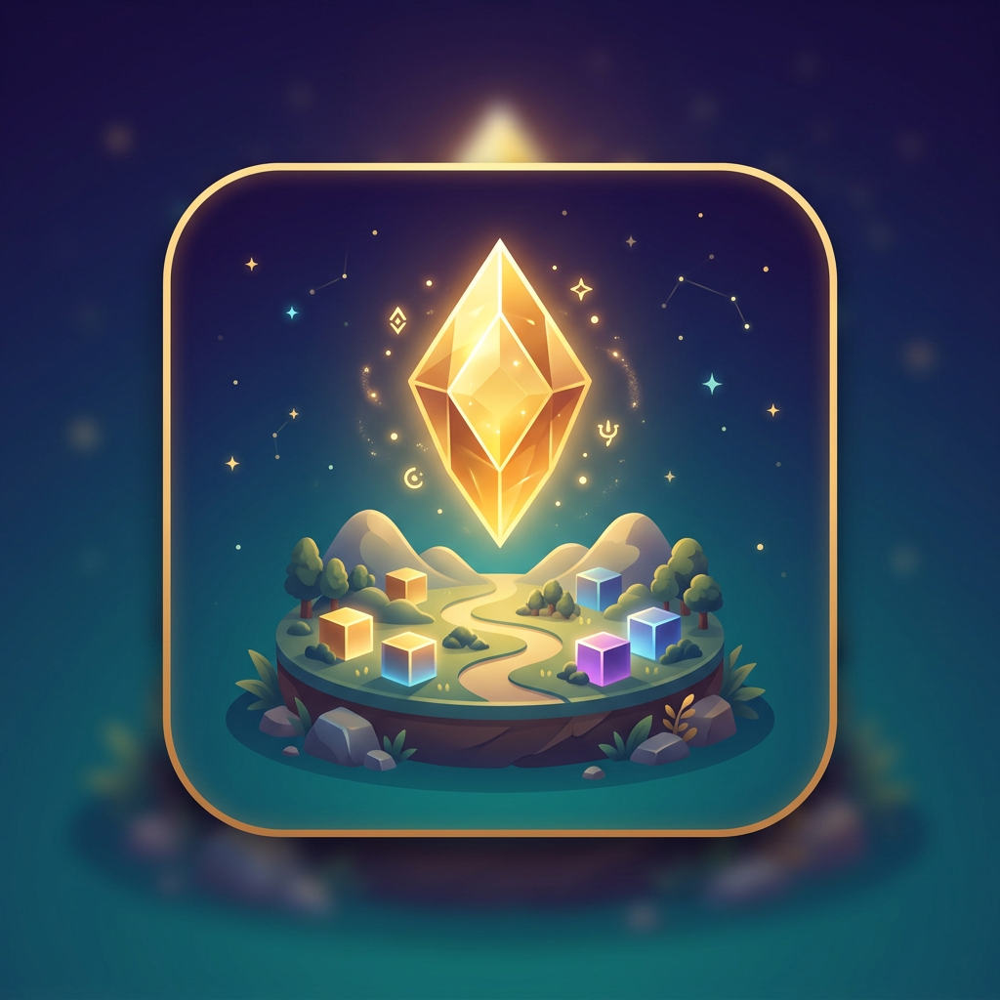

# کیمیا — ویرایشگر جهان

**Kimiya World Editor** یک کارگاه ساخت جهان سه‌بعدی سبک است. کاربر بازی نمی‌کند؛ جهان خودش را می‌سازد. نسخهٔ اول روی مرورگر (حتی موبایل ضعیف و Termux) اجرا می‌شود.

ترکیبی از آزادی Minecraft، ابزار معماری ساده، و یک موتور بازی کوچک.



## اجرای سریع

هر مرورگر مدرن با WebGL کافی است. نیازی به نصب Node نیست.

```bash
chmod +x start.sh
./start.sh 8080
```

سپس `http://127.0.0.1:8080` را باز کنید.

### Termux (Android)

```bash
pkg install python git
cd kimiya-world-editor   # یا ریشهٔ همین مخزن
python -m http.server 8080 --bind 0.0.0.0
```

در مرورگر همان گوشی آدرس `http://127.0.0.1:8080` را باز کنید. از منوی مرورگر می‌توانید «Add to Home Screen» بزنید.

## نسخهٔ اول (MVP)

1. **محیط سه‌بعدی** — دوربین اول‌شخص و سوم‌شخص، حرکت، پرش، زمین جزیره‌ای، مه سبک
2. **سیستم ساخت** — مکعب، کره، استوانه، مخروط، هرم، منشور، تخته، حلقه؛ حذف، انتخاب، جابجایی، چرخش، مقیاس
3. **قلم زمین** — تپه، چاله، صاف، هموار، رنگ‌آمیزی؛ شعاع و قدرت قابل تنظیم
4. **متریال** — خاک، سنگ، چوب، فلز، شیشه + رنگ دلخواه
5. **UI لمسی** — جویستیک، دکمهٔ عمل، نوار ابزار انگشتی، حالت تماشا / ساخت / زمین / انتخاب
6. **ذخیره** — autosave در مرورگر + دانلود/باز کردن فایل `.kimiya.json`

## کنترل‌ها

| موبایل | دسکتاپ |
|---|---|
| جویستیک چپ = حرکت | WASD / فلش‌ها |
| کشیدن روی صحنه = نگاه | راست‌کلیک و کشیدن = نگاه |
| دکمهٔ طلایی = گذاشتن / کندن زمین | کلیک چپ = ساخت / قلم |
| ↑ = پرش | Space پرش، Shift دویدن |
| ضربه روی شیء در حالت انتخاب | ۱–۴ حالت، F دوربین، Ctrl+Z واگرد، Ctrl+S ذخیره |

## معماری

لایه‌ها جدا هستند تا بعداً به موتور کامل تبدیل شود:

- `js/engine` — رندر کم‌مصرف، ورودی، دوربین
- `js/world` — مدل جهان (زمین، اشیا، آسمان)
- `js/editor` — ابزارها و واگرد
- `js/persist` — JSON
- `js/ui` — HUD لمسی

جزئیات در [`docs/ARCHITECTURE.md`](docs/ARCHITECTURE.md).

Three.js داخل `vendor/` است؛ آفلاین هم کار می‌کند.

## برنامهٔ توسعه

| مرحله | وضعیت |
|---|---|
| ۱. هستهٔ رندر و صحنه | انجام شد |
| ۲. دوربین و حرکت | انجام شد |
| ۳. زمین رویه‌ای | انجام شد |
| ۴. ساخت و تبدیل اشیا | انجام شد |
| ۵. قلم زمین | انجام شد |
| ۶. متریال و رنگ | انجام شد |
| ۷. UI لمسی موبایل | انجام شد |
| ۸. ذخیره / بارگذاری JSON | انجام شد |
| ۹. هوش مصنوعی سازندهٔ جهان | هوک معماری آماده است |
| ۱۰. آب‌وهوا و چرخهٔ روز | `Sky.setSun` آمادهٔ توسعه است |
| ۱۱. نورپردازی پیشرفته / سایه | خاموش برای باتری؛ قابل فعال‌سازی |
| ۱۲. ساخت شهر و prefab | پس از MVP |
| ۱۳. خروجی glTF برای موتورهای بازی | مدل از رندر جداست |

## فلسفهٔ عملکرد

اولویت با روانی و خلاقیت است، نه گرافیک سنگین: بدون سایهٔ realtime، سقف وضوح تصویر، هندسهٔ کم‌پلی، `powerPreference: low-power`، توقف رندر در پس‌زمینه.

## مجوز

کد پروژه برای استفادهٔ آزاد در همین مخزن است. Three.js تحت مجوز MIT.
