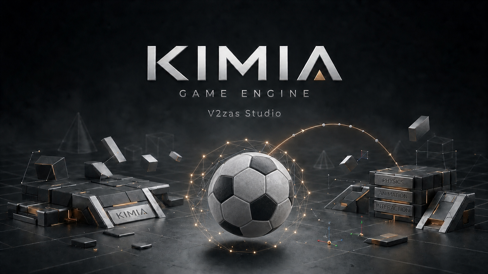

# KIMIA



<div dir="rtl">

موقع باز کردن بازی در مرورگر، فیلم معرفی (`Branding/kimia-intro.mp4`) پخش
می‌شود و با دکمهٔ «رد کردن / SKIP» می‌شود از آن گذشت. برای خاموش کردنش:
`kimia_world --no-intro`.

</div>


موتور بازی C++17 و ویرایشگر گزینه‌محور KIMIA World — ساخته‌شده از صفر، بدون وابستگی غیرآزاد.

**نسخهٔ موتور: `0.3.0`** (`kimia_world --version`؛ شماره با اندازهٔ تغییر جلو می‌رود: باگ/کوچک `+0.0.1`، مرحله/بزرگ `+0.1.0`) — دفترچهٔ نسخه‌ها: [CHANGELOG.md](CHANGELOG.md).

## وضعیت

- [x] هستهٔ مستقل (Types، Log، Profiler، FixedTimeStep)
- [x] ریاضیات (Vec2/3/4، Mat4، Quat، Camera)
- [x] گرافیک و خط لولهٔ دارایی (Primitive Meshes، OBJ، FBX، PNG/JPG، WAV/MP3)
- [x] Scene و SceneIO (هندل‌های ۱-مبنا + فرمت متنی v1)
- [x] فیزیک (گام ثابت ۱/۱۲۰، کره/صفحه/AABB، استرداد و اصطکاک)
- [x] Renderer (GL 3.3 با لودر dlopen + EGL، سایهٔ PCF، رسترایزر نرم‌افزاری)
- [x] Platform (ورودی LEVEL/EDGE + پنجرهٔ SDL2 اختیاری)
- [x] App — WebViewer (فریم‌ها در مرورگر، localhost:8080) و بوت‌استرپ Engine
- [x] GolfGame — بازی مرجع با نشانه‌گیری/شارژ/شوت، سازندهٔ زمین و `# demo`
- [x] KIMIA World — سازندهٔ بازی: زمین خالی، اجسام با سؤال و پاسخ، مدیریت و رنگ، PLAY در مرورگر
- [x] فرمت‌ها — OBJ+MTL (متریال/تکسچر و زیر-مش)، متریال و تکسچر FBX، OGG/FLAC، راهنمای .blend
- [x] فیزیک پیشرفته ۱ — جسم‌های دینامیک: جعبه‌هایی که می‌افتند، روی هم چیده می‌شوند، هل داده و شوت می‌شوند و با توپ برخورد می‌کنند
- [x] فایل در صحنه — «مدل از فایل» در کاتالوگ: فایل‌های OBJ/FBX پوشهٔ assets را در صحنه می‌گذاری (اندازهٔ دلخواه، نرمال‌سازی خودکار ابعاد، ذخیره/بارگذاری) + فیکس اسپاون توپ داخل جسم‌ها
- [x] ردیاب پرتو آفلاین — رندر هر دنیای `.kimia` به PNG با path tracing: PBR Cook-Torrance، روشنایی سراسری تا N جهش، آسمان + خورشید با سایهٔ نرم، BVH، خروجی دترمینیستیک (بایت-به-بایت یکسان)
- [x] رابط کاربری سنگین — دوربین مداری (چرخش با جهت‌ها، زوم، بازنشانی)، فهرست سلسله‌مراتبی اجسام و بازرس زنده (جابه‌جایی/ارتفاع/اندازه با گام دقیق ۰٫۱، رنگ، حذف) — همه در خود ویرایشگر گوشی
- [x] کنترل‌گر کاراکتر — بازیکن PLAY یک کپسول kinematic است: گرانش، پرش، فرود روی بلوک/جعبه، برخورد-و-لغزش با دیوارها
- [x] **HUD روی فریم، صدا و دوربین پشت توپ** — فونت بیت‌مپ ۵×۷ داخل موتور (`kimia::font`) که ضربه/جمع/پار/سوراخ و نوار قدرت را روی خودِ فریم می‌کشد (GL و نرم‌افزاری یکسان)؛ رویدادهای بازی (`Shot/Kick/Holed/Goal/RoundOver`) → صدای رویه‌ای (`AudioBuffer::tone/thock`) که مرورگر از `/sfx/<name>` پخش می‌کند؛ در حالت شوت دوربین نرم پشت توپ و در جهت نشانه می‌چرخد
- [x] **زمین گلف چندسوراخه** — سوراخ‌ها به ترتیب نام (`Hole_1..N`) بازی می‌شوند، فقط سوراخِ نوبت توپ را می‌گیرد، پرچم روی سوراخ بعدی، جدول ضربه‌ها با `par` از پروفایل («۱ ۰ ۲ | جمع ۳ | پار ۹ | ۶ زیر پار»)، صفحهٔ «پایان دور» با «دور جدید/منو»
- [x] **گلف روی KIMIA World** — حالت شوت (نشانه ← →، «شوت» را نگه دار، رها کن؛ شوت بعدی از جای توقف؛ ضربه‌شمار) + جسم «سوراخ» با قانون کاپ گلف مرجع؛ همه از پروفایل (`mode shot`، `scoring hole`) — فوتبال‌ها همان موتور را با `mode kick` می‌رانند
- [x] **باد و رکورد بهترین دور** — باد یک شتاب افقی روی توپِ در حرکت است (در هوا کامل، روی چمن کمتر و محدود به اصطکاک، هرگز روی توپ ایستاده)، از کلید `wind` پروفایل می‌آید و جهتش نسبت به نشانه روی HUD نوشته می‌شود (`WIND 3 <-`)؛ بهترین دور هر زمین در فایل دنیا ذخیره می‌شود و فقط با دور بهتر شکسته می‌شود
- [x] **پروفایل بازی** — یک موتور، چند بازی: «دنیای جدید → کدام بازی؟» → فوتبال خیابونی ایران: کوی ابوذر (۵×۱۶ آسفالت، توپ فانتزی، پرش بلند) / زمین چمن: کوی ابوذر (۲۵×۴۰، توپ دقیق) / مسابقه واقعی: بتل گراند (۴۰×۴۰) / زمین آزاد؛ هر بازی یک فایل متنی `Profiles/*.kimiaprofile` است که بدون کد قابل ویرایش/افزودن است

## نصب روی گوشی (Termux) — یک دستور

> **مهم: موتور روی شاخهٔ `main` گیت‌هاب نیست.** `main` فقط اسکلت اولیه
> (`Engine/Core` + دو تست) را دارد؛ موتور کامل روی شاخهٔ کاری
> `arena/01a07447-ai-codespace` است. اگر با `git clone` معمولی بگیری، بیلد
> فقط `kimia_tests` کوچک را می‌سازد و `build/bin/kimia_world` وجود نخواهد
> داشت. همیشه با `--branch` کلون کن:

```bash
pkg install -y git clang cmake ninja
git clone --branch arena/01a07447-ai-codespace https://github.com/javadxpro/AI-codespace.git
cd AI-codespace
bash Tools/termux_build.sh          # ابزار → cmake → build → 361/361 → دستور بعدی
./build/bin/kimia_world --port 8080 --profiles build/bin/profiles

سپس در مرورگر:

- **`http://127.0.0.1:8080`** — خودِ بازی
- **`http://127.0.0.1:8080/bench`** — **KIMIA Workbench**، ویرایشگر
  (دکمهٔ «⚙ Workbench» بالای صفحهٔ بازی هم همان‌جا می‌بردت)

در Workbench می‌توانی فایل `.obj`/`.fbx` وارد کنی، فیزیک رویش بگذاری،
برچسب بزنی، و انیمیشن و صدا را به دکمه وصل کنی.
```

`Tools/termux_build.sh` خودش شاخهٔ درست را تشخیص می‌دهد (اگر روی `main`
باشی، به شاخهٔ موتور می‌رود)، ابزار گم‌شده را با `pkg` نصب می‌کند، `cmake`
خراب را تعمیر می‌کند، با `-DKIMIA_WERROR=ON` و Release می‌سازد و تست‌ها را
اجرا می‌کند. گزینه‌ها: `--run` (بعد از بیلد اجرا کن)، `--clean`، `--port=N`.
به‌روزرسانی بعدی: `git pull && bash Tools/termux_build.sh`.

## نسخهٔ آفلاین (بسته‌ای که به بازیکن می‌دهی)

```bash
bash Tools/package_release.sh --game=golf     # → release/kimia-golf-0.3.0.tar.gz
```

بستهٔ خودکفا: باینری + پروفایل‌ها + `play.sh` + `worlds/` + `assets/` +
لایسنس‌ها + `VERSION.txt` (کامیت) + `MANIFEST.txt` (sha256). بازیکن فقط
باز می‌کند و `sh play.sh` می‌زند — بدون کامپایلر و بدون اینترنت. اسکریپت
اگر حتی یک اخطار بیلد یا یک تست قرمز ببیند بسته نمی‌سازد، و پیش از آرشیو
خودِ بسته را روی یک پورت یدکی اجرا و آزمایش می‌کند.
جزئیات: [Documentation/Release.md](Documentation/Release.md).

## ساخت و تست

```bash
cmake -B build -DKIMIA_WERROR=ON      # بدون build type = Release (خودکار)
cmake --build build -j4
./build/bin/kimia_tests      # 361/361 tests passed
ctest --test-dir build --output-on-failure
```

با Clang (Termux) و GCC هر دو **صفر اخطار** است؛ کامپایلر و build type در
خط `KIMIA build type: …` هنگام configure چاپ می‌شوند.

بیلد دوم بدون `-Werror` (شمارش اخطار باید ۰ باشد):

```bash
cmake -B build-warn -DKIMIA_WERROR=OFF
cmake --build build-warn -j4 2>&1 | grep -ci warning   # 0
```

بیلد headless (بدون SDL2) — WebViewer به‌جای پنجره:

```bash
cmake -B build-nosdl -DKIMIA_ENABLE_SDL2=OFF -DKIMIA_WERROR=ON
cmake --build build-nosdl -j4
./build-nosdl/bin/kimia_tests    # 361/361 tests passed
```

## هدف: چهار بازی روی یک موتور

همهٔ قابلیت‌ها (فیزیک، رندر، محیط، آب‌وهوا، ورودی، منو…) در خود موتورند؛ هر
بازی فقط یک **پروفایل** است که آن‌ها را انتخاب و تنظیم می‌کند. ترتیب ساخت:

| # | بازی | نقش | پروفایل | زمین | توپ |
| --- | --- | --- | --- | --- | --- |
| ۱ | **گلف کیمیا** | آزمایش و یادگیری موتور — فیزیک، منطق بازی را به چالش می‌کشد | `Profiles/golf.kimiaprofile` (`mode shot`، `scoring hole`) | ۱۰ × ۲۴ چمن | دقیق |
| ۲ | **فوتبال خیابونی ایران: کوی ابوذر** | اولین بازی جدی — فانتزی + حرکات نمایشی، ۵ در برابر ۵ | `Profiles/street.kimiaprofile` | ۵ × ۱۶ آسفالت | فانتزی |
| ۳ | **زمین چمن: کوی ابوذر** | جذب بقیهٔ فوتبالی‌ها — فوتبال دقیق و حرفه‌ای، ۱۱ در برابر ۱۱ | `Profiles/grass.kimiaprofile` | ۲۵ × ۴۰ چمن | دقیق |
| ۴ | **مسابقه واقعی: بتل گراند** | زمان زیاد می‌خواهد — PUBG-مانند، بدون pay-to-win؛ آرنا ۴×۴ و بتل گراند ۱۲ یا ۸ تیم ۴ نفره | `Profiles/battleground.kimiaprofile` | ۴۰ × ۴۰ | دقیق |

**سیاست انتشار:** هر بازی اول **کامل** می‌شود و بعد آنلاین منتشر می‌شود؛ تا
وقتی کامل نشده، نسخهٔ آفلاین همان بازی در دسترس است. چیزهایی که برای بازی
اول ساخته می‌شوند در موتور می‌مانند و بازی‌های بعدی از همان‌ها استفاده
می‌کنند.

پروفایل یک فایل متنی است: عددها را عوض کنید یا فایل پنجمی کنارشان بگذارید —
بازی جدید بدون یک خط کد در منو ظاهر می‌شود. جزئیات در
[Documentation/Profile.md](Documentation/Profile.md).

## KIMIA World — ویرایشگر گزینه‌محور

```bash
./build/bin/kimia_world --port 8080          # پروفایل‌ها از ./profiles (کنار باینری)
./build/bin/kimia_world --profiles Profiles  # یا از هر پوشهٔ دیگری
# سپس در مرورگر: http://localhost:8080
```

همه‌چیز با دکمه‌ها: دنیای جدید → **کدام بازی؟** → افزودن جسم (بازیکن، توپ،
بلوک، دیوار، دروازه، جعبه، مدل از فایل، سوراخ — هر کدام با سؤال فارسی مثل
«توپ: دقیق باشه یا فانتزی؟»؛ بازی‌هایی که یک توپ دارند سؤال نمی‌پرسند) →
مدیریت اجسام → محیط → PLAY (فوتبال: بدو و شوت کن؛ گلف: نشانه بگیر، «شوت» را
نگه دار، رها کن).

**دوربین مداری**: در سازنده و فهرست/بازرس، جهت‌ها دوربین را دور صحنه
(یا دور جسم انتخاب‌شده) می‌چرخانند؛ دکمه‌های «نزدیک‌تر / دورتر /
دوربین پیش‌فرض» زوم می‌کنند.

**فهرست و بازرس**: «مدیریت اجسام» حالا فهرست سلسله‌مراتبی همهٔ اجسام
است (۵ تا در هر صفحه). هر جسم را که انتخاب کنی، بازرسش با مقادیر زنده
باز می‌شود: جابه‌جایی X/Z و ارتفاع و اندازه با گام دقیق ۰٫۱، رنگ،
حذف، و جابه‌جایی آزاد با جهت‌ها. انتخاب روی صحنه هایلایت می‌شود.

دنیاها در فرمت SceneIO-v1 ذخیره می‌شوند و فایل‌های قدیمی `.kimia` هم
بار می‌شوند. جزئیات در [Documentation/World.md](Documentation/World.md).

## ردیاب پرتو — رندر آفلاین (path tracer)

هر دنیایی که در KIMIA World ساخته و ذخیره کرده‌ای را می‌توانی با
ردیاب پرتو به PNG رندر کنی (تمام CPU؛ بدون نیاز به GPU — روی Termux
هم اجرا می‌شود):

```bash
./build/bin/kimia_raytrace دنیای_من.kimia out.png
./build/bin/kimia_raytrace دنیای_من.kimia big.png \
    --width 960 --height 720 --spp 64 --bounces 4 \
    --eye 0 4.5 10 --target 0 0.5 -1 \
    --sun 0.45 0.5 0.45 --intensity 2.8 --sky 0.7 --exposure 1.0
# خروجی نمونه:
# RENDER دنیای_من.kimia -> big.png | 960x720 | 64 spp | 4 bounces | T s | 1662 triangles
```

- **PBR واقعی**: Cook-Torrance GGX + Fresnel شلیک برای خورشید، بازتاب آسمان
  به‌عنوان محیط، روشنایی سراسری (GI) با جهش‌های مسیر تا `--bounces`.
- **سایهٔ نرم خورشید**: خورشید یک قرص با مخروط نمونه‌برداری است (نیم‌سایهٔ واقعی).
- **BVH**: شتاب‌دهی درخت جعبه‌ها؛ `--brute` همان تصویر را بدون BVH می‌دهد
  (بایت-به-بایت یکسان — تست دارد).
- **دترمینیستیک**: RNG هر پیکسل seed ثابت دارد؛ رندر یک دنیا دو بار،
  همیشه فایل خروجی بایت-به-بایت یکسانی می‌دهد.
- مدل‌های «مدل از فایل» (OBJ/FBX) با رنگ/زبری موجودیت رندر می‌شوند
  (نمونه‌برداری تکسچر diffuse در ردیاب پرتو، مورد بعدی نقشهٔ راه است).

جزئیات کامل در [Documentation/TechnicalSpec.md](Documentation/TechnicalSpec.md) (بخش ردیاب پرتو).

## بازی گلف در مرورگر (WebViewer)

```bash
./build/bin/kimia_golf --web --port 8080
# سپس در مرورگر: http://localhost:8080
```

a/d نشانه‌گیری، نگه‌داشتن SPACE شارژ قدرت، رها کردن شوت. سازندهٔ زمین با
`--edit`: 1/2/3 ابزار، WASD حرکت، Enter قرار دادن، S ذخیره، L بارگذاری،
F بازی. جزئیات در [Documentation/Golf.md](Documentation/Golf.md).

نمای نمونهٔ RemoteView و First3DScene:

```bash
./build/bin/kimia_remote --port 8080
./build/bin/kimia_first3d --frames 1 --capture frame.png
```

## خط لولهٔ دارایی

```bash
./build/bin/kimia_assets_cli model.fbx texture.png sound.mp3
```

فرمت‌های پشتیبانی‌شده: **OBJ، FBX** (مش) — **PNG، JPG** (تصویر) — **WAV، MP3**
(صدا). جزئیات در [Documentation/Assets.md](Documentation/Assets.md).

## ساختار

```
Engine/Core      # انواع، گزارش‌گیری، پروفایلر، گام ثابت
Engine/Math      # بردارها، ماتریس‌ها، کواترنیون، دوربین (header-only)
Engine/Graphics  # MeshData، پریمیتیوها، OBJ، Image (PNG/JPG)
Engine/Assets    # AssetPipeline، Audio (WAV/MP3)، FBX
Engine/Scene     # Scene (هندل‌های ۱-مبنا) و SceneIO (فرمت متنی v1)
Engine/Physics   # PhysicsWorld: گام ثابت، کره/صفحه/AABB، استرداد و اصطکاک
Engine/Renderer  # GL/EGL (dlopen) + سایه + رسترایزر نرم‌افزاری
Engine/Platform  # ورودی + پنجرهٔ SDL2 اختیاری
Engine/App       # WebViewer (HTTP) و بوت‌استرپ Engine
Engine/Golf      # بازی مرجع: حالت‌ها، سازندهٔ زمین، شات نمایشی
Engine/World     # ویرایشگر گزینه‌محور: WorldData، WorldIO، شبیه‌سازی بازی
Engine/Profile   # پروفایل بازی: GameProfile + فرمت *.kimiaprofile (یک موتور، چند بازی)
Engine/Raytracer # ردیاب پرتو آفلاین: PBR + GI + BVH + خروجی PNG دترمینیستیک
Profiles/        # golf / street / grass / battleground — فایل‌های قابل‌ویرایش بازی‌ها
Examples/        # HelloWindow، First3DScene، RemoteView، GolfGame، WorldEditorApp
Tools/           # kimia_assets (CLI)، kimia_raytrace (رندر آفلاین)، kimia_asset_gen (دادهٔ تست)
Tests/           # سوئیت تست + دادهٔ تست
Documentation/   # مستندات هر زیرسیستم
ThirdParty/      # stb، dr_libs، ufbx (vendored)
```

مستندات در `Documentation/` و نقشهٔ راه در `ROADMAP.md`.
